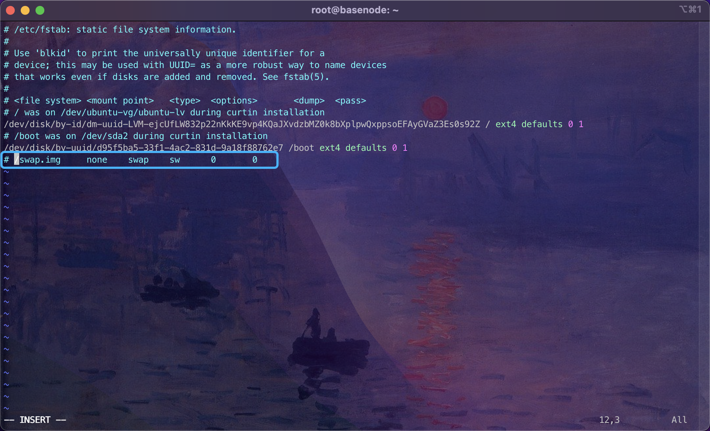

# Install Ubuntu on VirtualBox

This guide demonstrates how to install a Linux distro (Ubuntu) on a Virtual Machine (virtualbox).

> The Lab environment is on MacOS, but it applies to Windows with some minor changes.
>
> VirtualBox Version: 6.1.30
>
> Ubuntu: 20.04.3

[TOC]

## 1. Install virtualization tools

### 1.1 Install VirtualBox

You can download binaries from [Download VirtualBox](https://www.virtualbox.org/wiki/Downloads)

Alternatively, if you are using a package manager, just type `brew install --cask virtualbox`.

> :point_right: VirtualBox requires a kernel extension to work. The kernel extension module is blocked due to the macOS security restrictions. You have to enable it first, otherwise you may run into failure when configure the **Host Network Interface**.
>
> 
>
> **How to enable the extension**: System Preferences → Security & Privacy → General →  **Allow** *System software from developer "Oracle America, Inc" has been updated.*
>
> 

### 1.2 Configurate VirtualBox Network

In File → Host Network Manager → Properties

* Make sure you configure `vboxnet0` and set it to `192.168.56.1/24`.
* If the subnet is different, update IPv4 Address to `192.168.56.1` and IPv4 Network Mask `255.255.255.0`
* Disable DHCP

Now you have added `vboxnet0` 


## 2. Install Ubuntu Image

This section shows how to install and prepare **a Ubuntu base VM**. In the future, we can clone new VMs quickly from the base VM.

### 2.1 Download Ubuntu ISO

Download Ubuntu 20.04 LTS (Focal Fossa) from [Ubuntu 20.04](https://releases.ubuntu.com/20.04/).

Choose the **Server install image** to download.

### 2.2 Create and setup a VM

* Click **New** button option, Name the virtual machine `basenode`, select Linux Ubuntu (64-bit)


* Set **Memory size to 6G** 


* Create a virtual hard disk


* Select **VDI** as the hard disk file type


* Configure storage on physical hard disk as **Dinamically allocated**


* Set  the hard disk file size to **40G** and then create the VM.


* Now the VM is successfully created, select the VM and click the `settings` property on the top menu bar.


* Go to **System → Processor**, set the number of **CPUs to 2**. Save the changes.


* Go to **Storage → Controller: IDE**, now it should be empty. Then click the **disk icon** on the right of the **Optical Drive**. Select **choose a disk file**. Locate the **Ubuntu ISO image** you have downloaded before and select it.


### 2.3 Install Ubuntu

* Click **Start** to boot the `basenode` VM, and choose the system language, for example **English**.


* Choose **Continue without updating**.


* Select **default** setting for **Keyboard configuration**.


* Select **default** setting for **Network connections**.


* Select **default** setting for **Configure proxy**.


* Use **default** setting for **Ubuntu archive mirror**.


* Use **default** setting for **storage configuration**.


* Setup profile. For example:
  * Your name: `sadmin`
  * Your server's name: `basenode`
  * Pick a username: `sadmin`
  * Choose a password: `sadmin`


* Enable **Install OpenSSH server**


* Leave the **Featured Server Snaps** empty.


* Wait for the installation to complete. **Remember do not restart the VM at the moment**, **shutdown** the VM directly.


* In VM settings, go to **Storage → Controller: IDE** → Select `Ubuntu-20.04.3-live-server-amd64.iso` and then choose **remove disk from virtual drive** from the Optical Drive. This step is to prevent VM reinstall ubuntu on reboot.


### 2.4 Add Host-only Network Adapter to VM

> With **NAT** Network Adapter:
>
> * **If host can access internet, then VM can access internet**.
> * VM cannot ping another VM
> * VM can ping the host
> * **Host cannot ping VM**.
> * IP is `10.0.2.15`
> * Gateway is `10.0.2.2`
> * Requests from the VM is passed to NAT Engine, the NAT engine can leverage the host to access internet, the processed packet is then come back to VM via the NAT Engine.
>
> With **Host-only** Network Adapter：
>
> * The VM cannot access internet
> * VM can ping another VM
> * VM can ping host
> * Host can ping VM
> * IP is in range of the Host-only network interface, default is `192.168.56.*`
> * Gateway is the IP of Host-only network interface, default is `192.168.56.1`
>
> **With the help of these two network interfaces:**
>
> * **Host can ping VM**
> * **VM can access internet**
> * **VM can ping another VM**
> * **VM can ping host**

Go to **Settings → Network → Adapter 2**

Enable Network Adpater and Attach to `Host-only Adapter`, and select `vboxnet0` as the network.


### 2.5 Set IP of Adapter 2 Network

**Boot** the VM and **login** to the system.

Make sure you have the root priviledge to make below changes.

```sh
# switch to root user
sudo -i

# Update netplan config
vi /etc/netplan/00-installer-config.yaml
```

Update config with below content.

```yaml
network:
  ethernets:
    enp0s3:
      dhcp4: true
    enp0s8:
      dhcp4: no
      addresses:
        - 192.168.56.2/24
  version: 2
```

Then apply the changes.

```sh
netplan apply
```

After this change, the VM has two network adapters:

* One is NAT which will get an IP automatically, for example, 10.0.2.15, allowing external access from your VM
* One is host adapter, whose static IP is configured as `192.168.56.2`

### 2.6 Turn off swap

```sh
swapoff -a

vi /etc/fstab
# Comment or remove the line with `swap` keyword.
```



### 2.7 Update source

```sh
# 1. backup sources.list
sudo cp /etc/apt/sources.list /etc/apt/sources.list.bak

vi /etc/apt/sources.list
# Then press ESC + gg + dG to delete all lines
# Then Set paste

# 2. copy aliyun source to /etc/apt/sources.list
deb http://mirrors.aliyun.com/ubuntu/ focal main restricted universe multiverse

deb-src http://mirrors.aliyun.com/ubuntu/ focal main restricted universe multiverse

deb http://mirrors.aliyun.com/ubuntu/ focal-security main restricted universe multiverse

deb-src http://mirrors.aliyun.com/ubuntu/ focal-security main restricted universe multiverse

deb http://mirrors.aliyun.com/ubuntu/ focal-updates main restricted universe multiverse

deb-src http://mirrors.aliyun.com/ubuntu/ focal-updates main restricted universe multiverse

deb http://mirrors.aliyun.com/ubuntu/ focal-proposed main restricted universe multiverse

deb-src http://mirrors.aliyun.com/ubuntu/ focal-proposed main restricted universe multiverse

deb http://mirrors.aliyun.com/ubuntu/ focal-backports main restricted universe multiverse

deb-src http://mirrors.aliyun.com/ubuntu/ focal-backports main restricted universe multiverse

# 3. Update source list
sudo apt update
sudo apt upgrade
```

**Poweroff** current machine with `shutdown -h now`. The **basenode** VM is now successfully setup.


