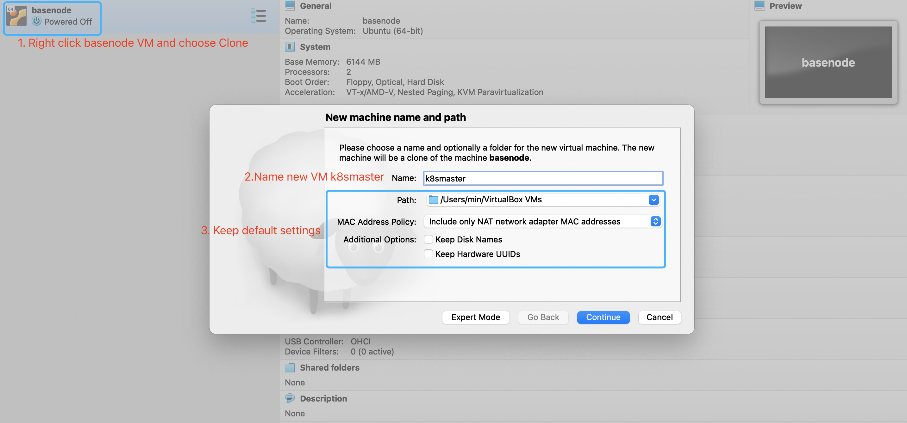
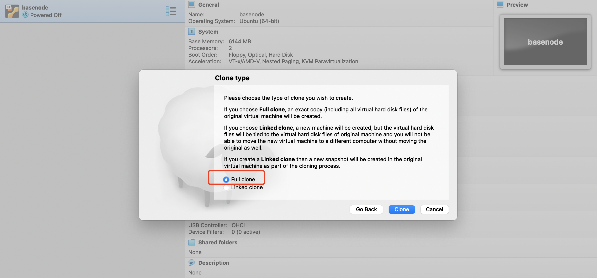
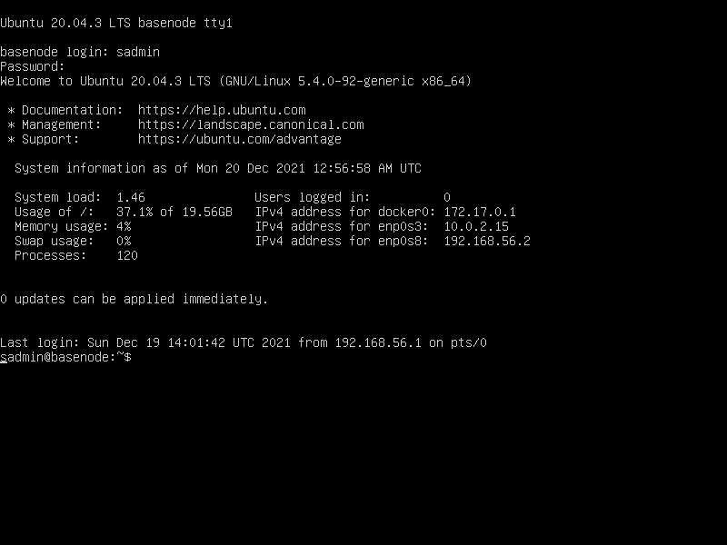
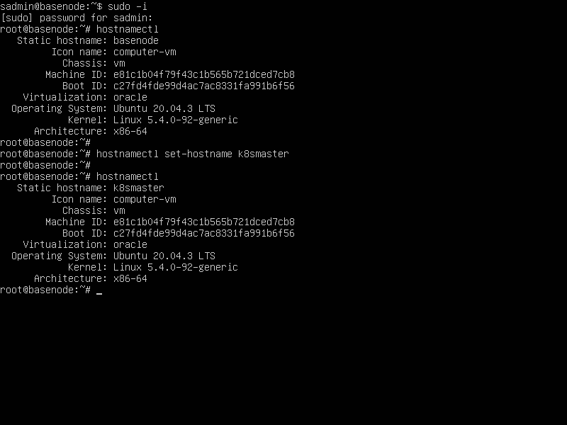

# Prepare three VMs for K8S cluster

In this guide, we will clone 3 VMs from basenode to create a Kubernetes Cluster. One VM for master node, the other two VMs for worker nodes.

[TOC]

## 1. Clone the master node

Before cloning from `basenode` VM, make sure it's powered off.

### 1.1 Clone master node from basenode VM and choose full clone





### 1.2 Update master hostname

* Power on `k8smaster` VM and login to the system using credentials. Username is `sadmin` by default, password is `sadmin` by default.



* Make sure you have the `root` user priviledge to do the change.

  ```sh
  sudo -i
  ```

* Check the hostname, it should print `basenode` at this time.

  ```sh
  hostnamectl
  ```

* Then update the hostname to `k8smaster` and check the updated hostname

  ```sh
  # update hostname
  hostnamectl set-hostname k8smaster
  
  # check updated hostname
  hostnamectl
  ```



### 1.3 Update host-only network IP

We need to change the IP of host-only network adapter as well. For master node, we set it to `192.168.56.10`

* Update the netplan config file

```sh
vi /etc/netplan/00-installer-config.yaml
```

* Update the addresses of `enp0s8` to `192.168.56.10`

```yaml
network:
  ethernets:
    enp0s3:
      dhcp4: true
    enp0s8:
      dhcp4: no
      addresses:
        - 192.168.56.10/24
  version: 2
```

* Apply the changes

```sh
netplan apply
```

Now we should be able to ssh from the host to the VM using `ssh sadmin@192.168.56.10`

## 2. Clone worker node k8sworker1

### 2.1 Clone worker node 1 from basenode VM and choose full clone

Follow the same steps in 1.1 to clone the worker node and name it `k8sworker1`.

### 2.2 Update worker 1 hostname

Follow the same steps in 1.2 to update the hostname to `k8sworker1`

```sh
sudo -i
hostnamectl set-hostname k8sworker1
```

### 2.3 Update host-only network IP

Follow the same steps in 1.3 to update the IP of host-only network adapter to `192.168.56.11`

```sh
# 1. open netplan config
vi /etc/netplan/00-installer-config.yaml

# 2. Update content
network:
  ethernets:
    enp0s3:
      dhcp4: true
    enp0s8:
      dhcp4: no
      addresses:
        - 192.168.56.11/24
  version: 2

# 3. Apply changes
netplan apply
```

## 3. Clone worker node k8sworker2

### 3.1 Clone worker node 2 from basenode VM and choose full clone

Follow the same steps in 1.1 to clone the worker node and name it `k8sworker2`.

### 3.2 Update worker 2 hostname

Follow the same steps in 1.2 to update the hostname to `k8sworker2`

```sh
sudo -i
hostnamectl set-hostname k8sworker2
```

### 3.3 Update host-only network IP

Follow the same steps in 1.3 to update the IP of host-only network adapter to `192.168.56.12`

```sh
# 1. open netplan config
vi /etc/netplan/00-installer-config.yaml

# 2. Update content
network:
  ethernets:
    enp0s3:
      dhcp4: true
    enp0s8:
      dhcp4: no
      addresses:
        - 192.168.56.12/24
  version: 2

# 3. Apply changes
netplan apply
```

## 4. Update `/etc/hosts` of all VMs

* In all three VMs, open `/etc/hosts` file

```sh
vi /etc/hosts
```

* Update the file with below content

```sh
# IPv4 hosts
::1         localhost
127.0.0.1   localhost
127.0.0.1   k8smaster
192.168.56.10 k8smaster.k8s.io k8smaster
192.168.56.11 k8sworker1.k8s.io k8sworker1
192.168.56.12 k8sworker2.k8s.io k8sworker2
```

At this time, all three VMs can resolve the hostname with each other.

:point_right:  Tips: If you run into the SSH Error in the host `REMOTE HOST IDENTIFICATION HAS CHANGED!`, try below command:

```sh
ssh-keygen -R your-ip

# delete previously stored public key of VMs from host
ssh-keygen -R 192.168.56.11
ssh-keygen -R 192.168.56.12
```
