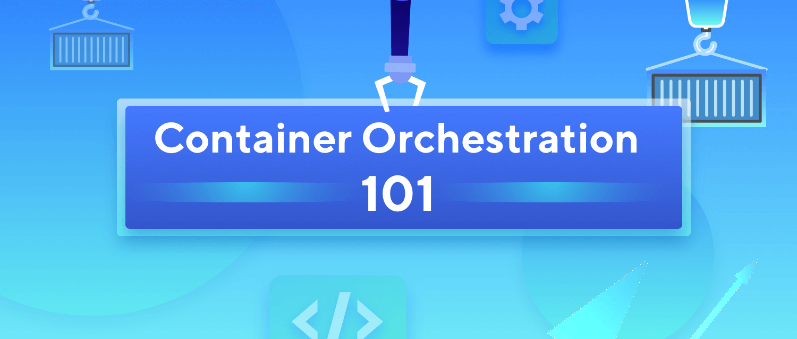

# Introduction to Kubernetes

[TOC]

## 1. Evolution of Software Architecture

### 1.1 Monolithic Architecture


The concept of monolithic model lies in different components of an application being combined into a single program on a single platform. 

#### Pros

* Simpler development and deployment
* Fewer cross-cutting concerns
* Better performance
* Perfect for small projects.

#### Cons

* Codebase gets curbersome overtime
* The monolith is becoming so complicated that no single person can understand it.
* Difficult to adopt new technologies
* Limited agility
* One unstable component can crash the entire system.

### 1.2 Service-oriented Architecture (SOA)


In this model, **service consumers** and **service providers** collaborated via middleware messaging components, often referred to as an **Enterprise Service Bus**.

* Centralized service providers registered with the ESB
* Business logic would be built into the ESB to integrate providers and consumers. 
* Service consumers could then find and communicate with these providers using the ESB.

#### Pros:

* Reusability of services
* Better maintainability
* Higher reliability
* Parallel development

#### Cons:

* Complex management
* Maintenance costs became high and ESB middleware expensive.
* Services tended to be large. They often shared dependencies and data storage.
* Extra overload: when using multiple services, this increases response time and decreases overall performance.

### 1.3 Microservice Architecture


Microservice apps consist of **multiple independent components** that are glued together with **APIs**.

The microservices approach focuses mainly on **business priorities and capabilities**.

#### Pros

* Easy to develop, test, and deploy
* Increased agility: several teams can work on their services independently and quickly
* Ability to scale horizontally

#### Cons

* Increased demand for automation, as every service should be tested and monitored
* Data consistency and transaction management becomes harder as each service has a database
* Security concerns
* Different programming languages

## 2. Containerization and docker

Microservices architecture presents a set of challenges

* Multiple Network Calls among services
* Multiple microservices deployed on the same host, services are less isolated

### Virtualization vs containers


### Containerization

**Containerization** packages together everything needed to run a single application or microservice (along with runtime libraries they need to run). The container **includes all the code, its dependencies** and even the operating system itself. 

High level container runtimes , such as **Docker** simplify the process of creating and maintaining containers.

#### Linux Namespace

* A feature provided by Linux Kernel to isolate resources.
* For containers, a namespace is what **defines the boundaries of a process**' "awareness" of what else is running around it.
* Namespace resources: IPC, Network, PID, Mount, PTS, USR.

#### Linux Cgroups

* The mechinism provided by Linux Kernel to control or monitor one or more processes.
* Control CPU, Memory, I/O of processes.
* Cgroup driver: systemd as init system will be the cgroup manager, but Docker uses cgroupfs as driver by default.

#### UnionFS

* Unite several directories into a single virtual filesystem
* Set readonly, readwrite, whiteout-able permission for each directory
* Layered File System.

## 3. Need for container orchestration tool



### Challenges from manage multi containers

* Increased usage of containers. In production, you can end up with dozens, even thousands of containers over time.
* Demand for a proper way managing those containers
* Integrate and orchestrate these modular parts
* Scale up and scale down based on the demand
* Make them fault tolerant
* Provide communication across a cluster

**Container orchestration** is the automated process of coordinating and organizing all aspects of individual containers, their functions, and their dynamic environments.

Using container orchestration, one can 

* manage when and how containers start and stop, 
* schedule and coordinate components' activities,
* monitor health, 
* institute failover and recovery processes. 

## 4. What is Kubernetes

> Kubernetes aka. k8s (pronounced /kates/)


Kubernetes is a portable, extensible, open-source platform for managing containerized workloads and services, that facilitates both declarative configuration and automation. 

* Open source container orchestration tool
* Orignially developed by Google
* First graduated CNCF project
* Open source version of Borg
* Helps manages containerized applictions in different environments

### Features provided by Kubernetes

* **High Availability**
  * Application High Availability building on ReplicaSet, StatefulSet
  * Kubernetes Components are high available
* **Security**
  * Services are running on TLS
  * Provide ServiceAccount and User Account
  * Isolation by Namespace
  * Secret
  * Taints, PSP, Network Policy
* **Portability**
  * multi host os
  * Multi cloud and hybrid cloud
* **Extensibility**
  * CRD
  * Plugins (Addons)

## 5. Kubernetes Architecture

You can visiualize a Kubernetes cluster as two parts: the **control plane** and **the worker machines, or nodes**.


### Components of the control plane

Control plane is the nerve center of our Kubernetes cluster.

* Control the cluster, along with data about the cluster’s state and configuration.
* Handle the important work of making sure your containers are running in sufficient numbers and with the necessary resources. 

#### kube-apiserver

* The Kubernetes API is the front end of the Kubernetes control plane, **handling internal and external requests**. 

* You can access the API through **REST** calls, through the **kubectl** command-line interface, or through other command-line tools such as kubeadm.

#### kube-scheduler

* Control plane component that **watches for newly created Pods** with no assigned node, and selects a node for them to run on.
* The scheduler considers the r**esource needs of a pod**, such as CPU or memory, along with the **health** of the cluster.
* It is only responsible for deciding which pod goes on which node. **It doesn't actually place the pod on the nodes**. The **kubelet** or the captain on the ship is who creates the pod on the ships.

#### kube-controller-manager

* Controllers take care of actually running the cluster
* Kubernetes controller-manager contains several controller functions in one. 
  * **Node-Controller**
  * **Replication-Controller**: It is responsible for monitoring the status of replicasets and ensuring that the desired number of PODs are available at all times within the set.
  * PV-Binder-Controller
  * Service-Account-Controller
  * StatefulSet
  * ReplicaSet
  * CronJob
  * Job-Controller
  * PV-Protection-Controller
  * Deployment-Controller
  * Namespace-Controller
  * Endpoint-Controller

* All of these controllers are packaged into a single process called `Kube-Controller-Manager`.

#### etcd

* A key value datebase for Cluster Data Store
* Configuration data and information about the state of the cluster.

### Components of the worker nodes

Node components run on every node, maintaining running pods and providing the Kubernetes runtime environment.

#### Nodes

It is an abstraction for the compute node. Every cluster has at least one worker node to run containerized applications.

#### Pods

The ultimate aim is to **deploy** our application in the form of **containers** on a set of machines that are **configured as worker nodes** in a cluster.

However, **Kubernetes does not deploy containers directly on the worker nodes**.

* A pod is **the smallest and simplest unit** in the Kubernetes object model.
* It represents **a single instance of an application**.
* Each pod is made up of a container or a series of tightly coupled containers

#### kubelet

* An agent that runs on each node in the cluster. It makes sure that containers are running in a Pod
* It communicates with the control plane
* It will not maintain containers not created by Kubernetes
* Jobs performed by kubelet: Register Node, Create Pods, Monitor Node and Pod

#### kube-proxy

* A **Pod network** is a virtual network that **spans across all the nodes in the cluster** to which all the Pods connect to.
* Each compute node also contains kube-proxy, a network proxy for facilitating Kubernetes networking services. 
* kube-proxy maintains network rules on nodes. 
* Works on the Level 4 TCP/IP stack
* Underhood is iptables or ipvs
  * Creates an IP table rule on each node in the cluster.
  * Forwarding traffic heading to the IP of the service to the IP of the actual Pod.

* It's job is to **look for new services** and every time a new service is created it creates the appropriate rules on each node to **farword traffic to those services to the backend pods**.

#### Container runtime

To run the containers, each compute node has a container runtime engine. For example, Docker.

### Addons

* kube-dns: provide DNS Service for the cluster
* Ingress Controller: provide external access for service
* Metrics Server: provide resource monitoring
* Dashboard: provide web-based UI

```sh
# View component definition files in kubeadm
ls /etc/kubernetes/manifests
```

## 6. Basic commands in `kubectl`

When running a `kubectl` command, 

- The kubectl utility is in fact reaching to the kube-api server.
- The kube-api server first authenticates the request and validates it.
- It then retrieves the inforamtion from the etcd cluster and reponse back to the user.

#### The worflow when a change is requested

```sh
curl -X POST /api/v1/namespaces/default/pods ...
```

1. Authenticate user
2. Validate request
3. Retrieve data
4. Update ETCD
5. Scheduler
6. Kubelet

- The scheduler continuously monitors the API server and realizes that there is a new pod with no node assigned.

- The scheduler identifies the right noed to place the new POD on and communicates that back to the kube-api server.

- The API server then updates the information in the ETCD cluster.

- The API server then passes that information to the kubelet in appropriate worker node.

- The kubelet then creates the POD on the node and instructs the container runtime engine to deploy the application image.

- Once done, the kubelet updates the status back to the API server and the API server then updates the data back in the ETCD cluster.

```sh
kubectl get po –oyaml -w

kubectl describe po xxx

kubectl exec

kubectl logs
```

## 7. Kubernetes Objects

### Imperative vs Declartive


* Everything in Kubernetes is abstracted as an object.
* Idempotency
* API Standardization

### Kubernetes Objects

* Kubernetes objects are **persistent entities** in the Kubernetes system. 
  * Kubernetes uses these entities to **represent the state of your cluster**.
  * By creating an object, you are specifing the cluster's **desired state**.
  * Kubernetes provides **Kubernetes API** to manage these objects.
* The API object is the **base unit** to manage a Kubernetes Cluster.
* New API objects will be introduced when new features are added to Kubernetes Cluster

> kubectl api-resources
>
> kubecl explain

### How to Describe a Kubernetes object

Every kubernetes object has below four types of properties

#### TypeMeta

The most fundamental definition of an object, uses **GKV(Group, Kind, Version)** to define the type of an object.

* **Group**: The kubernetes API is grouped into multiple such groups based on their purposes, `/metrics`, `/healthz`, `/version`, `/api`, `/apis`, `/logs`.
  - Core: `/api`: namespaces, pods, replication controllers, events, endpoints, nodes, bindings, persistent volumes, persistent volume claims, configmaps, secrets, services, etc.
  - Named: `/apis`: apps, extensions, networking, storage, authentication certificates etc.
* **Kind**: Defines the type of the object, for example, Node, Pod, Deployment, Service, etc.
* **Version**: Different API versions indicate different levels of stability and support.

#### Metadata

* **Namespace** and **Name** are the most important two properties of Metadata type. They uniquely identifies an instance of an object.
* **Label** defines whether the object can be recognized. An object can have any number of labels in key-value format. Supports filters.
* **Annotation** is also in key-value format, but serve different purposes: for example, assist deploying application, security policy and scheduling policy. Rolling update information in deployment.
* **Finalizer**: a resource lock. When deleting an object and the resource lock is not null, then it's an logical delete.
* **ResourceVersion**: Every object has an resource object at any time.

#### Spec

* providing a description of the characteristics you want the resource to have, i.e. the **desired state**.
* different objects may have different specs.
* Defined by the client

#### Status

* describes the ***current state*** of the object
* It's updated by the controllers.
* The **control plane** continually and actively **manages every object's actual state** to match the desired state

#### Demo: An exmaple of object definition file

```yaml
apiVersion: apps/v1
kind: Deployment
metadata:
  name: nginx-deployment
spec:
  selector:
    matchLabels:
      app: nginx
  replicas: 2
  template:
    metadata:
      labels:
        app: nginx
    spec:
      containers:
      - name: nginx
        image: nginx:1.14.2
        ports:
        - containerPort: 80

```

### An overview of Kubernetes objects by groups


## 8. Deploying applications using Kubernetes


### Node

* host machine, can be physical machine or virtual machine

### Pod

* Smallest unit in kubernetes for scheduling
* An abstraction over container
* Contains a group of containers, normally one application per pod
* Sharing PID, IPC, Network, File System etc.
* Each Pod gets its own IP address
* Pods are ephermeral, each time new Pod are created, they are assigned a new IP.

### Service

* Service is static or perment IP address.

* Services enable communication between variaous components within and outside of the application.

* Every Pod can be attached to a service. Different lifecyle compared to Pod.
* By default, The service is in fact like **a virtual server inside the node**. the service has its own IP address and that IP address is called **the cluster IP of the service**. (DB Service)
* Expose **external service** (Web App Service)
  * NodePort: **makes an internal Pod accessiable** on a Port on the Node.
  * 
* Load Balancing

### Ingress

* manages external access to the services in a cluster
* exposes HTTP and HTTPS routes from outside the cluster to services within the cluster. 


* Works on level 7 HTTP stack

### ConfigMap & Secret

* **ConfigMaps** are used to **pass configuration data in the form of key value pairs** in Kubernetes.e.g. service url

  - Create ConfigMap

  - Inject into Pod

* **Secrets** are used to **store sensitive information** like passwords or keys.

  They are similiar to ConfigMap except that they're **stored in n encoded or hashed format.**

### Volume

* Mount external volume to Pod
* Volume: define the source of volume
* VolumeMounts: define how the volume mount to Pod

### Deployment

The deployment provides us with the capability to **upgrade the underlying instances** seamlessly using rolling updates, undo changes, and pause and resume changes as required.

* Provides declarative updates to applications.
* Scale up and down by specifying replicas
* The Kubernetes deployment object lets you:
  - Deploy a replica set or pod
  - Update pods and replica sets
  - Rollback to previous deployment versions
  - Scale a deployment
  - Pause or continue a deployment

## 9. Demo

```sh
# 1. Pod
# Create nginx yaml
kubectl run webapp --image=nginx --dry-run=client -o yaml > web-pod.yaml


# 2. Service
# Create nginx svc yaml
kubectl expose pod webapp --name=webappsvc --port=80 --target-port=80 --dry-run=client -o yaml > web-svc.yaml
kubectl delete svc webappsvc

# 3. Deploy
# Create Objects
kubectl create deployment --image=nginx webappdeploy --dry-run=client -o yaml > web-deploy.yaml

# Update Objects
kubectl edit deployment webappdeploy
kubectl scale deployment webappdeploy --replicas=3
kubectl set image deployment nginx nginx=nginx:1.18
```

### Create Config Maps Imperative

```sh
# cm short for configmap
kubectl create cm

# simple ones using --from-literal option
kubectl crete configmap	\
		<config-name> --from-literal=<key>=<value>
		
kubectl create configmap app-config --from-literal=APP_COLOR=blue --from-literal=APP_MOD=prod

# complicate ones using --from-file option
kubectl crete configmap
		<config-name> --from-file=<path-to-file>

kubectl create configmap app-config --from-file=app_config.properties
```

### Create Config Maps Imperative

Create a `config-map.yaml`

```yaml
apiVersion: v1
kind: ConfigMap
metadata:
	name: app-config
data:
	APP_COLOR: blue
	APP_MODE: prod
```

```sh
kubectl create -f config-map.yaml
```

### Use ConfigMaps in Pods

Add the `envFrom` option in`pod-definition.yaml`.

`envFrom` is a list

```yaml
apiVersion: v1
kind: Pod
metadata:
	name: simple-webapp-color
spec:
	containers:
	- name: simple-webapp
	  image: nginx
	  ports:
	  - containerPort: 8080
	  envFrom:
	  - configMapRef:
	  		name: app-config
```

To check  the usage of envFrom:

```sh
kubectl explain pods --recursive | grep envFrom -A3
```

### Deploying Wordpress and MySQL


Steps to do this deployment

```sh
# Create mysql-secret for mysql Pod
kubectl create secret generic mysql-secret \
--from-literal=MYSQL_DATABASE=blog \
--from-literal=MYSQL_USER=admin \
--from-literal=MYSQL_PASSWORD=admin \
--from-literal=MYSQL_ROOT_PASSWORD=admin

# Create wordpress-secret for wordpress pod
kubectl create secret generic wordpress-secret \
--from-literal=WORDPRESS_DB_USER=root \
--from-literal=WORDPRESS_DB_PASSWORD=admin \
--from-literal=WORDPRESS_DB_NAME=blog \
--from-literal=WORDPRESS_DB_HOST=dbsvc

# create mysql pod
kubectl apply -f mysql-pod.yaml

# mysql svc
kubectl expose pod mysql --name=dbsvc --port=3306

# create wordpress pod
kubectl apply -f wordpress-pod.yaml

# wordpress nodeport svc
kubectl expose pod wordpress --name=myblog --port=80 --type=NodePort

# Users can visit wordpres
# Check the port of myblog service,
kubectl get svc myblog
# Then user can visit from the browser using VM host ip, 192.168.56.11:port, 192.168.56.12:port

```

## References

https://docs.microsoft.com/en-us/dotnet/architecture/dapr-for-net-developers/the-world-is-distributed

https://rubygarage.org/blog/monolith-soa-microservices-serverless

https://www.redhat.com/en/topics/containers/kubernetes-architecture

https://kubernetes.io/docs/concepts/overview/working-with-objects/_print

https://kubernetes.io/docs/tasks/access-application-cluster/ingress-minikube/
